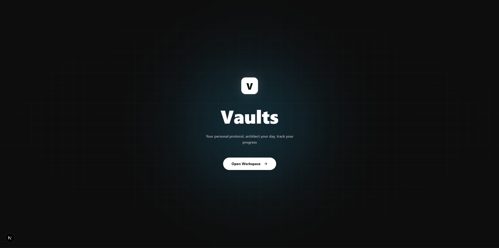
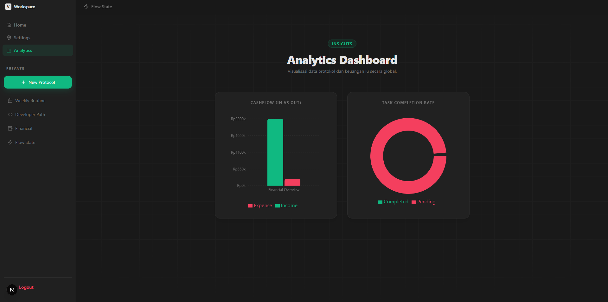
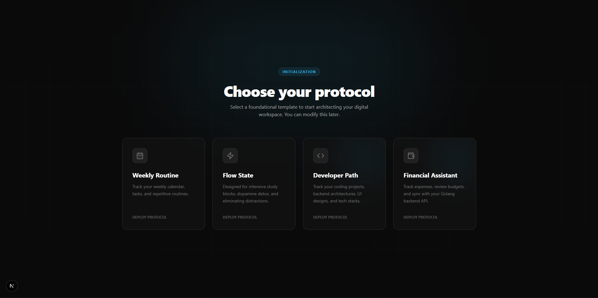
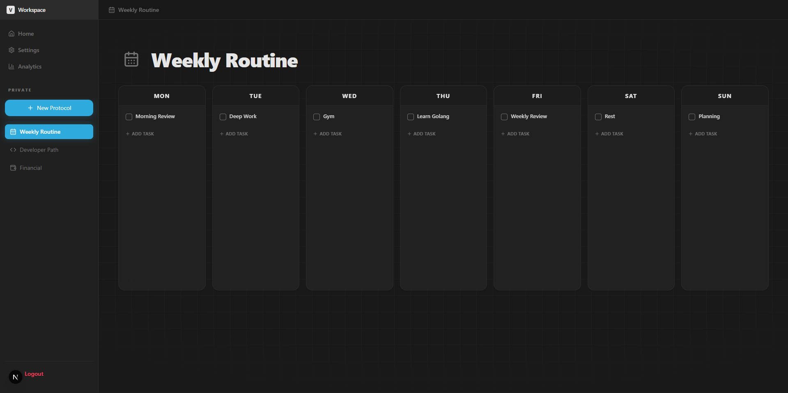
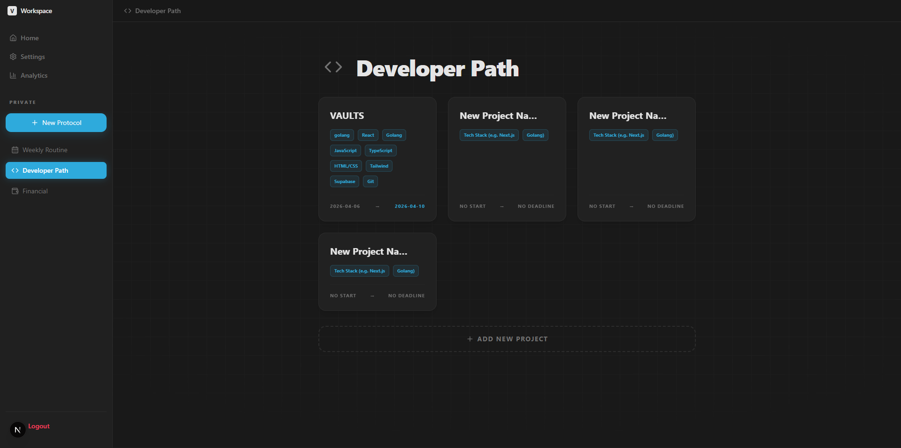
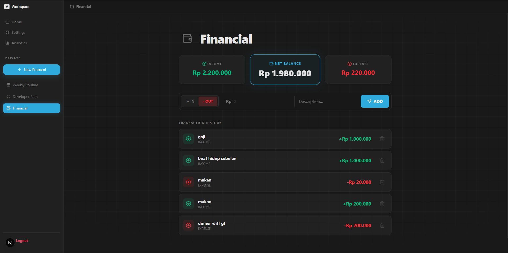
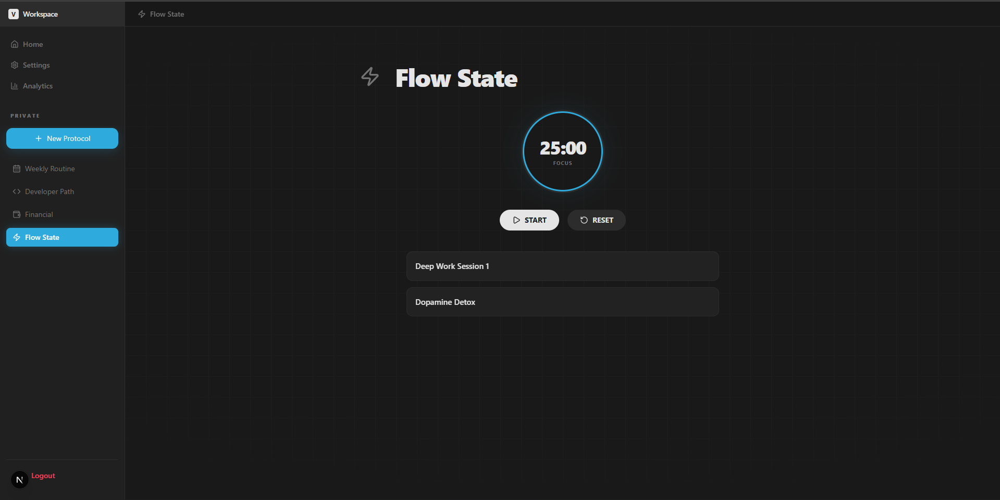
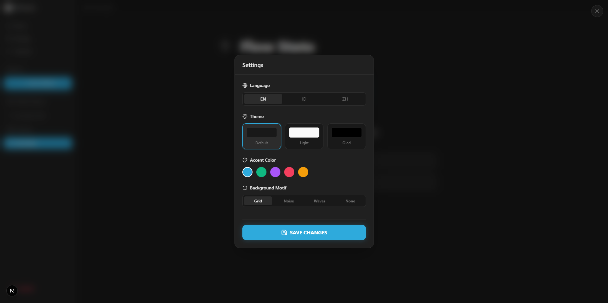

<h1 align="center">📦 Vaults</h1>
<p align="center">
  <i>Your personal protocol. Architect your day, track your progress, and secure your focus without the friction of complex setups.</i>
</p>

<p align="center">
  
  
  
  
</p>

---

## 📌 Project Overview & Intent

**Vaults** is a zero-friction, minimalist personal productivity dashboard designed as a streamlined alternative to over-complicated data-organizers. There are no canvas layouts to design, no nested blocks to configure, and no markdown syntaxes to memorize. It is built strictly for high-performance execution: you simply boot up the interface, activate your workspace, and trigger predefined structural routines with a single click.

Originally developed to orchestrate my daily engineering workflows, financial tracking, and deeply focused studying phases, this repository serves as a powerful standalone operational control unit.

---

## ⚡ The 4 Core Protocol Modes

* ⚡ **Flow State Workspace:** An immersive study/deep-work workspace equipped with an active countdown timer matrix and responsive geometric backdrop configurations (Grid, Noise, or Waves).
* 💼 **Developer Path:** A programmatic lifecycle scheduler built to instantly map out software engineering project scopes, active tech-stacks, and baseline release deadlines.
* 🗓️ **Weekly Routine Protocol:** A quick-click digital board tracking static daily habits, automated morning reviews, and weekly task synchronization lists.
* 💰 **Financial Assistant:** An integrated personal balance book handling transactional logging (Income vs Expenses) which channels telemetry vectors straight to a concurrent backend REST API engine.

---

## 📸 Interface Showroom

### 1. Unified Workspace Portal & Calibration Hub
*A premium terminal landing page featuring isolated grid patterns, ambient lighting glows, and fluid layout controls.*
<p align="center">
  
</p>
<p align="center">
  
</p>

### 2. Operational Dashboards & Routine Trackers
*Visual compilation showcasing the analytics engine charts, automated focus timers, task boards, and asset books.*
<table>
  <tr>
    <td align="center"><b>Analytics & Telemetry</b></td>
    <td align="center"><b>Bespoke Personal Settings</b></td>
  </tr>
  <tr>
    <td align="center"></td>
    <td align="center"></td>
  </tr>
  <tr>
    <td align="center"><b>Flow State Module</b></td>
    <td align="center"><b>Financial Ledger Engine</b></td>
  </tr>
  <tr>
    <td align="center"></td>
    <td align="center"></td>
  </tr>
  <tr>
    <td align="center"><b>Developer Project Canvas</b></td>
    <td align="center"><b>Weekly Habits Registry</b></td>
  </tr>
  <tr>
    <td align="center"></td>
    <td align="center"></td>
  </tr>
</table>

---

## 🚀 Local Development Setup

### Prerequisites
* Go 1.20+ Installed
* Node.js v18+ & npm

### Service Initialization Command
Follow these operational sequences to execute both the web-client deployment interface and the transaction storage endpoint core engine locally:

```bash
# 1. Fire up the concurrent Golang Gin server pipeline (Runs on port :8080)
cd backend
go mod download
go run main.go

# 2. Spin up the modern Next.js client environment (Runs on port :3000 in separate terminal)
cd frontend
npm install
npm run dev
